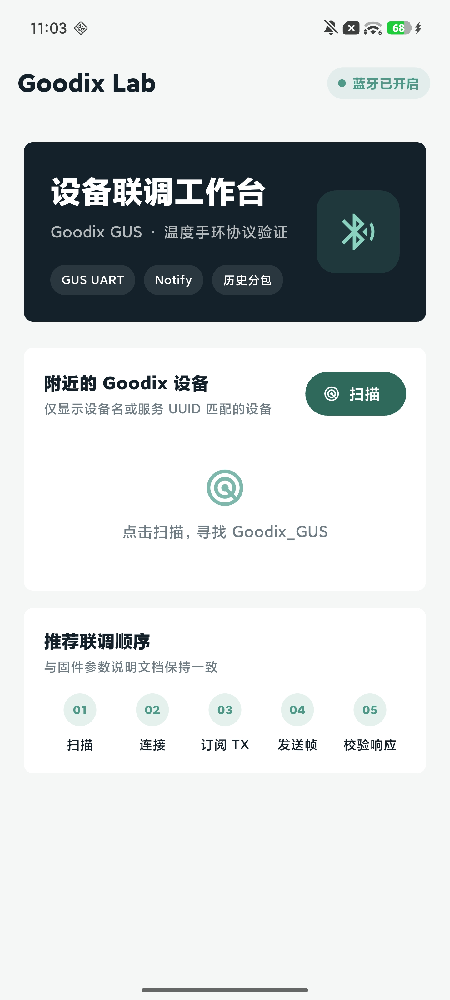
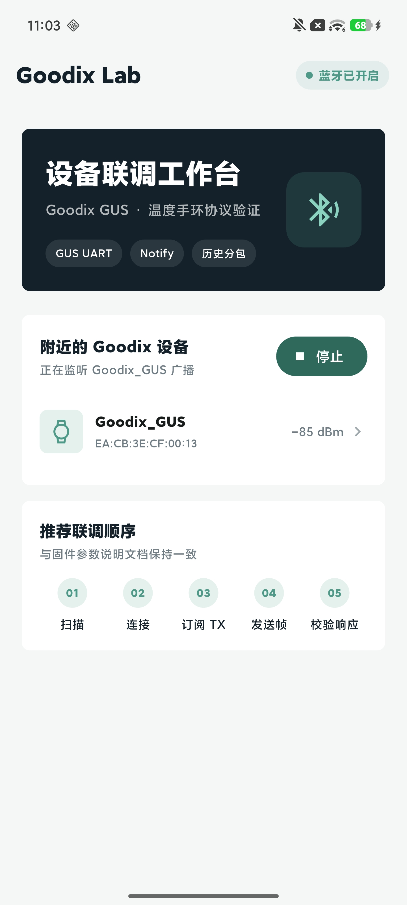
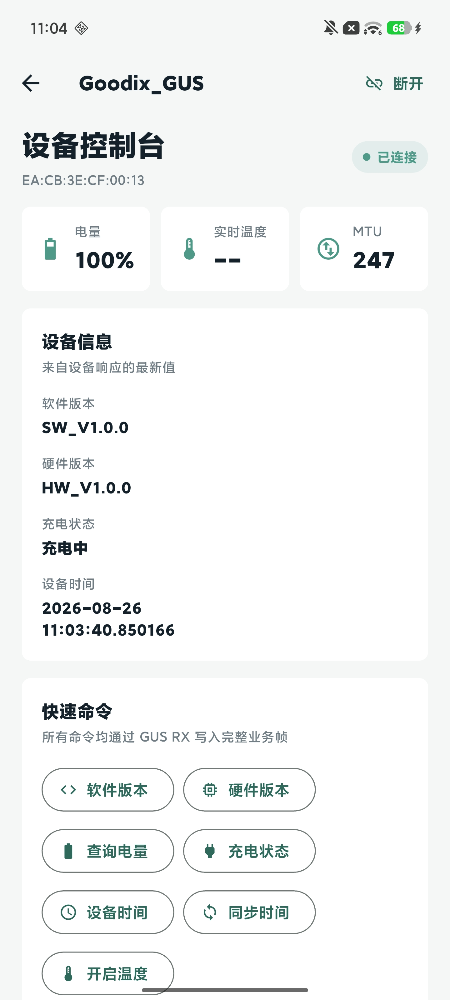

# TRCK

A Flutter-based BLE workbench for Goodix GUS temperature wristbands. The app covers discovery, connection, service setup, GUS UART commands, live temperature notifications, historical data transfer, and TXT export.

[中文](README.md) · [English](README.en.md)

## Features

- Scan devices named `Goodix_GUS` or advertising the GUS service UUID.
- Discover services, subscribe to TX notifications, and negotiate an MTU (target: 247).
- Query and synchronize device time, software version, hardware version, battery, and charging state.
- Receive live temperature notifications and display validity and Celsius values.
- Query history capacity and read all or not-yet-uploaded records.
- Validate packet order, merge history records, and sort them by device time.
- Share or save history as a TXT file.
- Inspect TX, RX, SYS, and error logs in the device console.

## Preview

|                Home                |            Scan results            |             Device console             |
| :--------------------------------: | :--------------------------------: | :------------------------------------: |
|  |  |  |

## Requirements and setup

- Flutter SDK with Dart SDK `^3.11.5`
- Android, iOS, macOS, Windows, or Linux with a BLE adapter
- Bluetooth enabled and platform-specific permissions granted for real-device testing

Check the Flutter environment:

```bash
flutter doctor
```

Run the project:

```bash
git clone <repository-url>
cd goodix_ble_tool
flutter pub get
flutter run
```

List available targets and select one explicitly when needed:

```bash
flutter devices
flutter run -d <device-id>
```

Example builds:

```bash
flutter build apk       # Android
flutter build ios       # iOS (requires macOS and Xcode)
flutter build macos     # macOS
flutter build windows   # Windows
flutter build linux     # Linux
```

## Typical workflow

1. Enable system Bluetooth and tap **Scan** on the home page.
2. Select a `TRCK` device and wait for service discovery and TX notification subscription.
3. Use the device console to query versions, battery, charging state, and time.
4. Start live temperature notifications, then read all or not-yet-uploaded history.
5. Share or save the history as a TXT file when you need an offline record.

## GUS BLE protocol

| Item                      | UUID / value                           |
| ------------------------- | -------------------------------------- |
| Service                   | `A6ED0201-D344-460A-8075-B9E8EC90D71B` |
| TX (device notifications) | `A6ED0202-D344-460A-8075-B9E8EC90D71B` |
| RX (application writes)   | `A6ED0203-D344-460A-8075-B9E8EC90D71B` |
| Flow                      | `A6ED0204-D344-460A-8075-B9E8EC90D71B` |
| Local data command        | `0x36`                                 |

The base frame format is:

```text
[0x00, frameId, command, subCommand, ...payload]
```

Implemented command groups:

| Command               | Purpose                             |
| --------------------- | ----------------------------------- |
| `0x11`                | Software / hardware version         |
| `0x12`                | Battery / charging state            |
| `0x10`                | Query or synchronize device time    |
| `0x34`                | Start live temperature              |
| `0x36 / 0x04`         | Query history capacity              |
| `0x36 / 0x00`, `0x01` | Read not-yet-uploaded / all history |
| `0x36 / 0x02`         | Stop history upload                 |

Frame builders, parsers, and status codes are in [`lib/services/gus_protocol.dart`](lib/services/gus_protocol.dart). BLE scanning, connection handling, and notification processing are in [`lib/controllers/ble_controller.dart`](lib/controllers/ble_controller.dart).

## Project structure

```text
lib/
├── controllers/       BLE state and workflows
├── core/              Theme and global styles
├── models/            Device, temperature, and log models
├── pages/             Home and device console pages
├── services/          BLE wrapper, GUS protocol, history export
└── widgets/           Reusable UI components
doc/                   README preview screenshots
```

## Platform notes

- Android 12+ requires Nearby devices permission; older versions may also require location permission.
- iOS, macOS, and Windows Bluetooth permissions are controlled by the platform projects.
- Web is not a primary target; browser Web Bluetooth requires a separate adaptation.
- History transfer depends on device-side packetization. The app validates first/last flags and packet indexes and reports malformed data in the console log.
